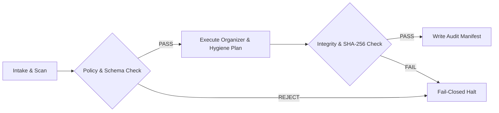

# BPMN Process Model — DocumentOrganizer

```mermaid
flowchart LR
    ST01["Intake & Scan"] --> GW01{"Policy & Schema Check"}
    GW01 -->|PASS| ST02["Execute Organizer & Hygiene Plan"]
    GW01 -->|REJECT| EX01["Fail-Closed Halt"]
    ST02 --> GW02{"Integrity & SHA-256 Check"}
    GW02 -->|PASS| ST03["Write Audit Manifest"]
    GW02 -->|FAIL| EX01
```
