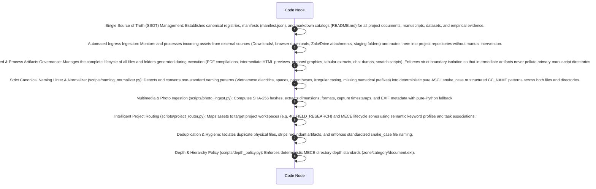
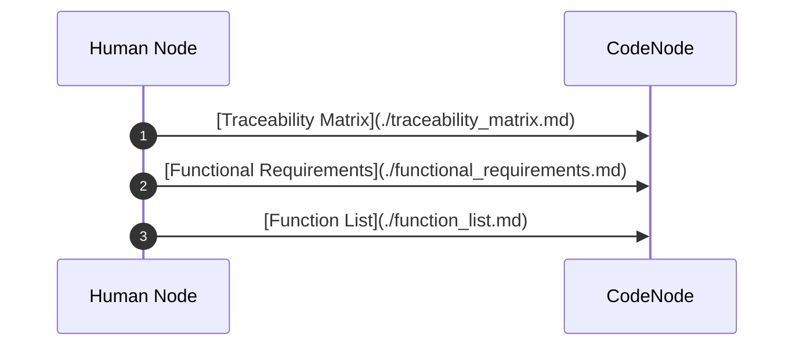

# Sequence Diagrams

> Source hash: 875226e81eaf831940e324b0cbfcf1f6bfdacc198dd4ddbd7226c5a7cef3175c

### UC-001: Core Capabilities

```mermaid
sequenceDiagram
    autonumber
    participant CodeNode as Code Node
    CodeNode->>CodeNode: Single Source of Truth (SSOT) Management: Establishes canonical registries, manifests (manifest.json), and markdown catalogs (README.md) for all project documents, manuscripts, datasets, and empirical evidence.
    CodeNode->>CodeNode: Automated Ingress Ingestion: Monitors and processes incoming assets from external sources (Downloads/, browser downloads, Zalo/Drive attachments, staging folders) and routes them into project repositories without manual intervention.
    CodeNode->>CodeNode: Generated & Process Artifacts Governance: Manages the complete lifecycle of all files and folders generated during execution (PDF compilations, intermediate HTML previews, cropped graphics, tabular extracts, chat dumps, scratch scripts). Enforces strict boundary isolation so that intermediate artifacts never pollute primary manuscript directories (docs/).
    CodeNode->>CodeNode: Strict Canonical Naming Linter & Normalizer (scripts/naming_normalizer.py): Detects and converts non-standard naming patterns (Vietnamese diacritics, spaces, parentheses, irregular casing, missing numerical prefixes) into deterministic pure ASCII snake_case or structured CC_NAME patterns across both files and directories.
    CodeNode->>CodeNode: Multimedia & Photo Ingestion (scripts/photo_ingest.py): Computes SHA-256 hashes, extracts dimensions, formats, capture timestamps, and EXIF metadata with pure-Python fallback.
    CodeNode->>CodeNode: Intelligent Project Routing (scripts/project_router.py): Maps assets to target project workspaces (e.g. 40_FIELD_RESEARCH) and MECE lifecycle zones using semantic keyword profiles and task associations.
    CodeNode->>CodeNode: Deduplication & Hygiene: Isolates duplicate physical files, strips redundant artifacts, and enforces standardized snake_case file naming.
    CodeNode->>CodeNode: Depth & Hierarchy Policy (scripts/depth_policy.py): Enforces deterministic MECE directory depth standards (zone/category/document.ext).
```

### UC-004: Traceability & Documentation

```mermaid
sequenceDiagram
    autonumber
    participant HumanNode as Human Node
    HumanNode->>CodeNode: [Traceability Matrix](./traceability_matrix.md)
    HumanNode->>CodeNode: [Functional Requirements](./functional_requirements.md)
    HumanNode->>CodeNode: [Function List](./function_list.md)
```
